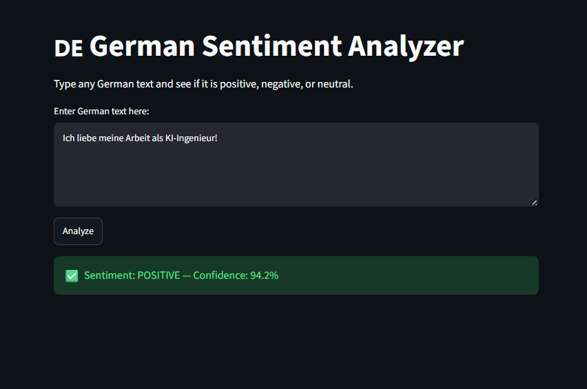
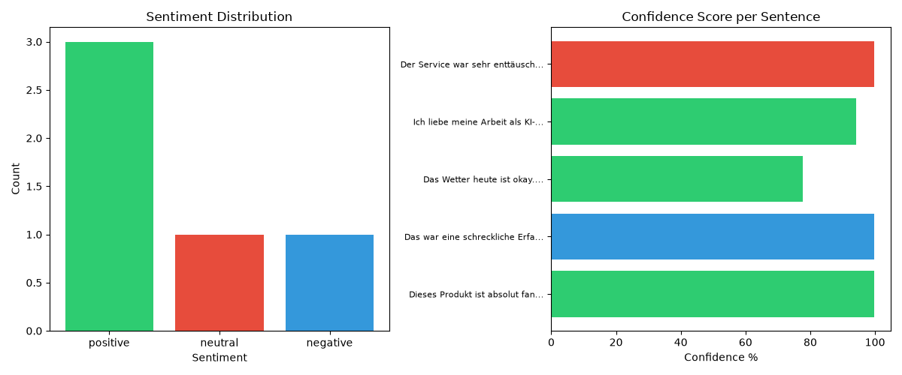

# German Sentiment Analyzer 🇩🇪

A Natural Language Processing project that analyzes the sentiment 
of German text using a pre-trained BERT model from HuggingFace.

## Results

## What this project does
- Takes German text as input
- Classifies it as **positive**, **negative**, or **neutral**
- Returns a confidence score (0-100%)
- Saves results to CSV for further analysis

## Model
- **Model:** oliverguhr/german-sentiment-bert
- **Architecture:** BERT (Bidirectional Encoder Representations from Transformers)
- **Trained on:** German reviews, tweets, and news articles
- **Approach:** Transfer learning — using a pre-trained model instead of training from scratch

## Sample Results
| Text | Sentiment | Confidence |
|------|-----------|------------|
| Dieses Produkt ist absolut fantastisch! | positive | 99.84% |
| Der Service war sehr enttäuschend. | negative | 99.85% |
| Das Wetter heute ist okay. | positive | 77.61% |

## Key Finding
The model performs with very high confidence on clearly positive 
and negative sentences (99%+). Neutral sentences are harder — 
"Das war eine schreckliche Erfahrung" was classified as neutral 
despite being negative. This is a known limitation of sentiment 
models on ambiguous or sarcastic text.

## Tech Stack
- Python
- HuggingFace Transformers
- Pandas
- Matplotlib
- Jupyter Notebook

## What I learned
- How to use pre-trained NLP models with HuggingFace pipelines
- Transfer learning — adapting existing models instead of training from scratch
- Working with German language AI models
- Building end-to-end NLP pipelines